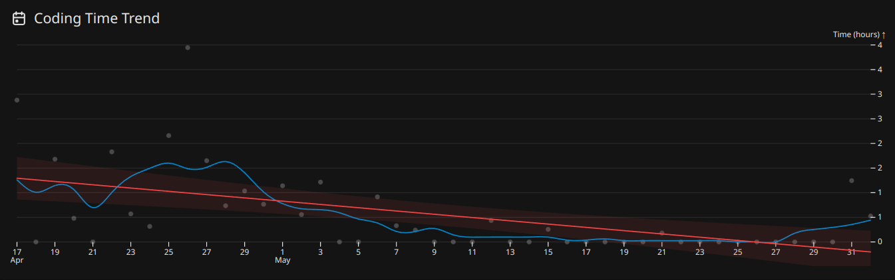

+++
title = "Sprint 1 and pre-sprint planning"
date = 2024-04-11
authors = ["Suryakiran, student number: 2312154"]
+++

# My Contribution and Commitment to the Project

As this was the first sprint, we started with the basics[^1][^2]: deciding on the roles, scheduling, project requirements and the like. I volunteered to be a developer, although I specialized into the role of backend developer later. During the first sprint I set up the project and implemented user signup[^3], login[^4] and authentication[^4]. We did have plans for email verification, but it was shelved due to time constraints.


# Tracking and Self-Improvement

I primarily tracked my time using wakatime(a vscode extension that tracks time spent) and manually logged my time spent on research and other tasks, as I found using a hosted solution to be invasive and not very well suited to my work patterns which involve short bursts intermixed with longer sessions. This sprint's time data is in text because wakatime only supports history of 2 weeks. I switched to another service in the following weeks due to this.

```
8-4-2024: 1 hour 2 minutes
9-4-2024: 5 hours 49 minutes
10-4-2024: 12 minutes
11-4-2024: 3 minutes
```

# Reflection and Self-Directed Learning

In this section, consider your role, tasks, and responsibilities during the sprint, using the questions from Moodle. Provide relevant links in your response.



Management of Individual Tasks

Describe the tasks you have handled according to your SCRUM role during this sprint and evaluate your success in managing these tasks. Utilize the Moodle questions and link to your response.


Communication

Using the Moodle questions, describe how you have communicated with your project team during the sprint. Evaluate the effectiveness of your communication and discuss any efforts you’ve made to improve it. Include relevant links.

[^1]: [Meeting 1 - minutes](https://dev.azure.com/Software-Engineering-2024/Group%204/_wiki/wikis/Group-4.wiki/18/The-1st-meeting-March-22-2024)

[^2]: [Meeting 2 - minutes](https://dev.azure.com/Software-Engineering-2024/Group%204/_wiki/wikis/Group-4.wiki/19/The-2nd-meeting-March-23-2024)

[^3]: [Work item 740](https://dev.azure.com/Software-Engineering-2024/Group%204/_workitems/edit/740)

[^4]: [Work item 809](https://dev.azure.com/Software-Engineering-2024/Group%204/_workitems/edit/809)